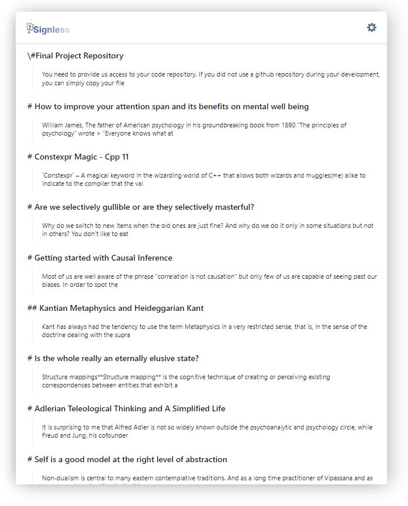
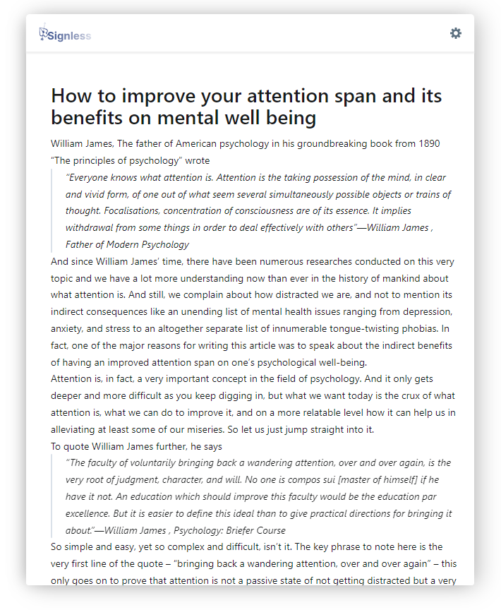

# Signless

Anonymous Publishing Platform to Enable Civil Discourse on the Web.

This is still a work in progress. I am working on a few things, some I have completed and some I have not:

- [x] Save offline and sync with db. (`PARTIAL`)
- [x] Basic analysis and highlighting of the post using a pretrained language model.
- [x] Markdown preview.
- [x] Store, Retrieve and Analyze post without any user identiying data while still having the ability to publish, edit, analyze, and delete. (`PARTIAL`)
- [x] Feed View (`PARTIAL`)
- [ ] Shareable links
- [ ] Tagging and Searchability
- [ ] Advanced Analysis
- [ ] Anonymous Commenting System.

## Usage 

Before starting the client, rest, or the worker. Start the rabbitmq and mongo server by running `deploy-all.sh`.

### Client

1. Go to the client directory and run `npm install`
2. Then run `npm start`

### Rest Server

1. Go the rest directory and run `npm install`
2. Then run `npm start`

### Worker 

1. Go to the worker directory and run `python3 worker.py`

## Screenshots

- Basic Editor View
  - This the the default view of the app.

- Analysis View
  - Click on the gear icon on the right and select `Analyze`

- Feed View
  - Chronological Feed View

- Published View
  - Click on the gear icon on the right and select `Publish` the post you are working on.
  - You can see it via the feed view.
